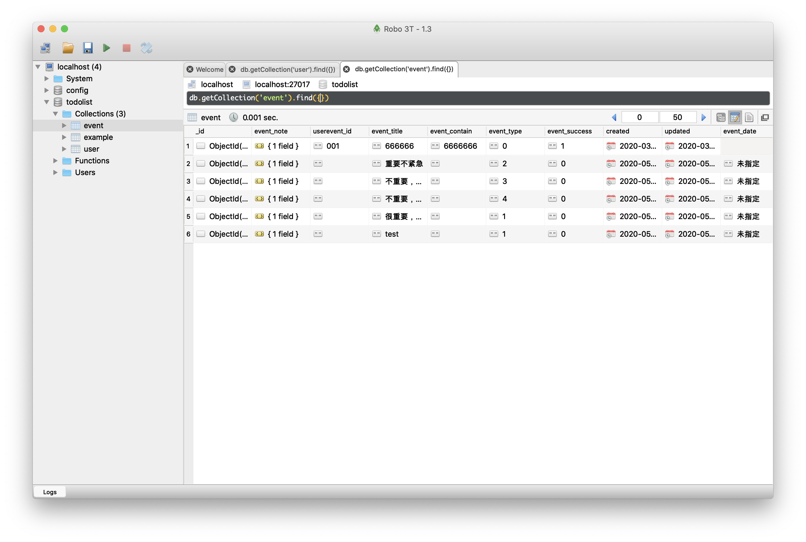

# 前端构建

## 前端基本环境配置

环境需求vue-cli(脚手架)、mongodb、nodejs

在`mongodb中 数据库 -》集合-》文档`文档的数据结构和JSON基本一样。所有存储在集合中的数据都是 BSON 格式。BSON 是一种类似 JSON 的二进制形式的存储格式，是 Binary JSON 的简称。
所以我们可以将mongodb想象成一个大json对象处理，传统的数据库中表和表之间的外键关联都不存在了.取而代之的是json格式的类树形结构.这就是转到mongodb之后最大的区别.  设计时把复杂的东西抽象成一个树形结构,而不是像从前那样先抽象成一个个实体,然后再抽象实体之间的关系，对前端而言mongodb做设计比sql做设计要简单很多

1. 利用vue-cli初始化项目`vue create todo_list`

2. 通过brew 安装mongodb

    ```
    使用 OSX 的 brew 来安装 mongodb的命令如下：

    sudo brew install mongodb
    要安装支持 TLS/SSL 命令如下：

    sudo brew install mongodb --with-openssl
    如果要安装开发版本，可以使用下面的命令：

    sudo brew install mongodb --devel
    然后，使用命令mongod --version来查看mongo DB是否安装成功。
    ```

    后由于mongodb已经不开源头
    我在这里直接安装默认的社区版本，执行`brew install mongodb-community` 也可以参考文档安装指定的版本；
    之后采用`show dbs` 查看安装是否成功

- 如果发现数据库链接不上，可以在~/.bashrc中配置 `export PATH=/usr/local/Cellar/mongodb-community/4.2.3/bin:${PATH}`

- 之后执行`brew services start mongodb-community` 最后进行mongo连接

    

这里推荐使用[robo3t](https://robomongo.org/download)这个mongodb可视化工具来快速的构建字典表

## 前端项目结构

```
todolist
|
└─── NodeApi 后端api提供文件
│     |--controller  控制层，对数据库进行操作
|     |--db          数据库实例
|     |--middlewares node中间件
|     |--router      向前端暴露的接口
|     |--app         入口js
|     |--config      全局配置
|
└─── src 前端项目目录
│     |--api           前端请求接口
|     |--assets        图片相关
|     |--components    项目公关组件
|     |--router        路由
|     |--views         视图层
```

前端主要的界面和设计就不细说，有兴趣的可以去github上看一下交互细节和页面逻辑。[github地址](https://github.com/czkm/TodoList/tree/master)
